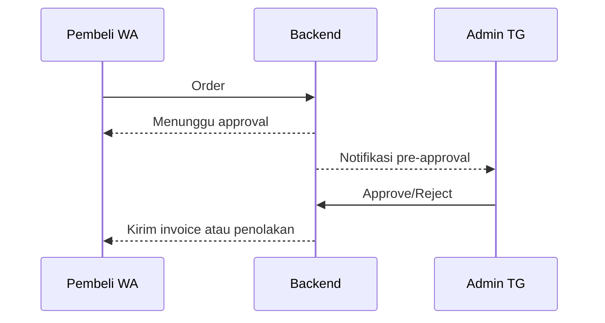

# Bot Backend

Backend Express + Prisma untuk Telegram dan WhatsApp.

## Daftar Isi
- [Fitur Utama](#fitur-utama)
- [Prasyarat](#prasyarat)
- [Struktur Proyek](#struktur-proyek)
- [Variabel Lingkungan](#variabel-lingkungan)
- [Pengembangan Lokal](#pengembangan-lokal)
- [Deploy ke Alibaba Cloud ECS via SSH](#deploy-ke-alibaba-cloud-ecs-via-ssh)
- [Pengujian](#pengujian)
- [Contoh Alur WhatsApp](#contoh-alur-whatsapp)
- [n8n flows](#n8n-flows)
- [Kontrol Kode push](#kontrol-kode-push)
- [Telegram Webhook](#telegram-webhook)
- [Webhook WhatsApp](#webhook-whatsapp)
- [Nginx + SSL](#nginx--ssl)
- [PM2](#pm2)
- [Catatan](#catatan)
- [Diagram Alur Pre-Approval](#diagram-alur-pre-approval)

## Fitur Utama
- RESTful API Node.js (Express) dengan Prisma & PostgreSQL
- Integrasi bot Telegram dan WhatsApp
- Sinkronisasi varian serta akun via Google Sheets
- Alur otomatis melalui n8n
- Dukungan pembayaran QRIS dan ShopeePay

## Prasyarat
- Node.js ≥18
- PostgreSQL
- Domain dengan HTTPS (untuk webhook Telegram)

## Struktur Proyek
```
.
├── src/            # kode sumber Express & worker
├── prisma/         # schema Prisma & seed
├── test/           # unit test
├── server.js       # entry point produksi
└── ecosystem.config.js # konfigurasi PM2
```

## Variabel Lingkungan
Salin `.env.example` menjadi `.env` kemudian isi variabel berikut sesuai kebutuhan. Daftar lengkap tersedia di `.env.example`.

| Nama | Fungsi |
|------|--------|
| `DATABASE_URL` | Koneksi PostgreSQL |
| `TELEGRAM_BOT_TOKEN` | Token bot Telegram |
| `ADMIN_CHAT_ID` | ID admin di Telegram |
| `ADMIN_API_TOKEN` | Header `x-admin-token` untuk endpoint admin |
| `WEBHOOK_SECRET_PATH` | Path rahasia webhook Telegram |
| `PUBLIC_URL` | URL publik aplikasi |
| `WA_ACCESS_TOKEN` | Token API WhatsApp |
| `WA_PHONE_NUMBER_ID` | Nomor pengirim WhatsApp |
| `PAYMENT_QRIS_TEXT` | Pesan QRIS yang ditampilkan |
| `N8N_BASE_URL` | URL webhook n8n |
| `N8N_TOKEN` | Token bearer untuk n8n |
| `SHEET_SYNC_SECRET` | HMAC untuk sinkronisasi spreadsheet |

## Pengembangan Lokal
1. **Persiapan Lingkungan**
   ```bash
   cp .env.example .env   # isi kredensial penting
   ```
2. **Siapkan database PostgreSQL**
   ```bash
   createuser -P bw5user
   createdb -O bw5user bw5db
   ```
3. **Install dependensi dan migrasi**
   ```bash
   npm install
   npx prisma migrate deploy
   node src/preflight/guard.js   # tambah kolom bila belum ada
   npm run seed                   # isi produk default
   ```
4. **Jalankan server pengembangan**
   ```bash
   npm start
   ```
5. **Endpoint yang tersedia**
   - `/healthz` → cek DB
   - `/status` → ringkasan produk/akun/order
   - `/stock/options?productId=PROD` → stok durasi per produk
   - `/webhook/telegram/:secret`
   - `/webhook/wa`
   - `/api/variants-sync`

   Contoh mengambil stok:
   ```bash
   curl "https://yourdomain.com/stock/options?productId=CHATGPT"
   ```

## Deploy ke Alibaba Cloud ECS via SSH

Langkah-langkah berikut memandu pemasangan backend ini di instansi
ECS (Ubuntu/Debian) menggunakan koneksi SSH.

### Persiapan Instansi
1. **Buat ECS baru** melalui konsol Alibaba Cloud. Pilih Ubuntu 22.04 LTS dengan minimal 1 vCPU dan 1 GB RAM (gunakan spesifikasi lebih tinggi untuk produksi) serta disk ≥20 GB.
2. **Tambahkan Security Group** yang akan mengatur lalu lintas masuk/keluar.

### Atur Security Group
Konfigurasi default keamanan perlu disesuaikan agar aplikasi dapat diakses dengan aman.

**Inbound rules yang disarankan:**
- `22/TCP` (**SSH**) → izinkan hanya dari IP administrator.
- `80/TCP` (**HTTP**) → izinkan dari `0.0.0.0/0`.
- `443/TCP` (**HTTPS**) → izinkan dari `0.0.0.0/0`.
- `3000/TCP` → opsional; untuk akses langsung ke aplikasi sebelum Nginx, batasi ke IP Anda.
- `5432/TCP` → opsional; buka hanya jika PostgreSQL diakses dari luar dan batasi ke IP tertentu/VPC.

**Outbound rules** umumnya dapat dibiarkan **Allow All**.

### Deploy Aplikasi
1. **Masuk ke server** setelah aturan security group siap:
   ```bash
   ssh root@<ECS_PUBLIC_IP>
   ```
2. **Pasang dependensi sistem.** Perbarui paket dan instal Git, Node.js
   18+, dan klien PostgreSQL:
   ```bash
   apt update && apt install -y git curl build-essential
   curl -fsSL https://deb.nodesource.com/setup_18.x | bash -
   apt install -y nodejs postgresql
   ```
3. **Siapkan database PostgreSQL.** Anda bisa memakai ApsaraDB RDS atau
   PostgreSQL lokal. Di konsol RDS buat database dan user, lalu catat
   connection string berikut sebagai `DATABASE_URL`:
   ```
   postgresql://<USER>:<PASSWORD>@<RDS_ENDPOINT>:5432/<DB>?schema=public
   ```
4. **Clone dan konfigurasi aplikasi.**
   ```bash
   git clone <REPO_URL> bw5 && cd bw5
   cp .env.example .env          # isi DATABASE_URL dan token lain
   npm install
   ```
5. **Migrasi & seed database.**
   ```bash
   npx prisma migrate deploy
   npm run seed
   ```
6. **Jalankan backend.**
   ```bash
   npm start
   ```
   Untuk menjalankan secara permanen gunakan PM2 dan atur Nginx sesuai
   contoh pada bagian di bawah.

## Pengujian
Jalankan seluruh tes unit:
```bash
npm test
```

## Contoh Alur WhatsApp

Menu awal kini menampilkan tombol "🛡️ Klaim Garansi" bersama menu lain. Untuk memilih durasi produk dan melihat stok real-time gunakan perintah `durasi <kode>` yang akan menampilkan daftar seperti:

```
Durasi 30 hari – Stok: 5
```

Saat pembayaran dikonfirmasi, sistem akan memanggil `reserveAccount()` untuk mengunci stok agar tidak terjadi oversell.

Flow baru:

- WA: pilih produk → pilih durasi (cek stok) → tekan tombol **Beli 1**.
- WA: klaim garansi → setelah admin approve, bot meminta nomor ShopeePay dan menunggu input.
- Admin: pre-approval bisa diaktifkan per sub-produk (contoh `PROD:30`).

### Normalisasi ShopeePay

- Nomor ShopeePay dinormalisasi sebelum disimpan: spasi/dash dihapus, hanya 10–15 digit dan harus diawali `08`.
- Contoh: input `" 08-123 456 789 0 "` → disimpan dan ditampilkan kembali sebagai `081234567890`.
- Jika format salah, bot membalas: `Format ShopeePay tidak valid. Kirim nomor 10–15 digit diawali 08 (contoh 081234567890).`
 - Contoh balasan sukses: `Nomor ShopeePay diterima: 081234567890. Refund diproses maksimal 2×24 jam.`

### Idempotensi Ekstra

- Endpoint pre-approval (`approve`/`reject`) dan klaim (`approve`/`reject`/`ewallet`/`refunded`) aman dari double-tap.
- Jika status sudah final, panggilan ulang mengembalikan `200` dengan `{ idempotent: true }` tanpa efek samping.

## Integrasi n8n
Backend dapat mengirim setiap event order ke workflow n8n sehingga otomatisasi bisa dilakukan tanpa mengubah kode.

1. Buat workflow di n8n dengan trigger **Webhook**. Catat URL webhook yang dihasilkan, misal `https://n8n.example/webhook/bw5`.
2. Isi variabel `N8N_BASE_URL` pada `.env` dengan URL tersebut dan `N8N_TOKEN` dengan secret internal token.
3. Jalankan ulang server. Setiap event yang tersimpan melalui `addEvent` akan dikirim sebagai JSON ke `N8N_BASE_URL + '/events'` dengan header `X-Internal-Token`.
4. Di n8n, gunakan data JSON tersebut untuk melanjutkan otomatisasi (update spreadsheet, kirim notifikasi, dll).

Contoh payload yang dikirim:
```json
{
  "orderId": 1,
  "kind": "ORDER_CREATED",
  "message": "Order INV-123 created",
  "meta": {},
  "actor": "SYSTEM",
  "source": "system"
}
```

Event lain yang mungkin diterima:

```json
{ "product_code": "CHATGPT", "status": "OUT_OF_STOCK" }
```

Contoh skema `stockalerts` terbaru:

```prisma
model stockalerts {
  id             String   @id @default(cuid())
  product_code   String
  last_status    String
  last_notified_at DateTime?

  @@unique([product_code])
}
```

## n8n flows

Selain event real-time, backend menyediakan beberapa alur khusus untuk integrasi spreadsheet via n8n:

- `POST /tx-append` akan menambahkan baris baru ke tab **TRANSACTIONS**.
- Pekerja berkala memanggil flow untuk menyinkronkan ringkasan:
  - **AKTIF** → order dengan `expires_at >= now`
  - **BERAKHIR** → order dengan `expires_at < now`

Contoh payload yang dikirim ke `/tx-append`:

```json
{
  "ts": "2024-01-01T00:00:00.000Z",
  "invoice": "INV-123",
  "buyer": "628123456789",
  "code": "PROD30",
  "variant_id": "uuid-v1",
  "order_status": "DELIVERED",
  "fulfilled_at": "2024-01-01T00:00:00.000Z",
  "expires_at": "2024-01-31T00:00:00.000Z",
  "account_id": 1,
  "channel": "WA"
}
```

## Kontrol Kode push

Master varian dapat dipush langsung dari spreadsheet tanpa seed manual.

Endpoint:

- `POST /api/variants-sync` dengan HMAC `x-signature` menggunakan `SHEET_SYNC_SECRET`.

Contoh payload:

```json
{
  "product": "CGPT-SHARE",
  "type": "sharing",
  "duration_days": 30,
  "code": "CGPT-SHARE-30",
  "active": true
}
```

Respons:

```json
{ "ok": true, "variant_id": "uuid" }
```

Untuk sinkronisasi akun melalui `/api/sheet-sync`, sertakan `natural_key` agar idempoten. Format yang dianjurkan dari Apps Script: `<sheet>|<row>|<code>`. Jika username kosong, Apps Script wajib mengirim `natural_key` dengan format: `natural_key = <sheet_name>|<row_number>|<code>` (contoh: `Produk Netflix|123|NET-1P1U-30`).

Catatan operasi: `fifo_order` tidak berubah saat edit; gunakan `reorder:true` bila ingin memindahkan prioritas.

## Telegram Webhook
Pastikan domain sudah HTTPS, kemudian set webhook:
```bash
curl -F "url=https://YOUR_DOMAIN/webhook/telegram/$WEBHOOK_SECRET_PATH" \
  https://api.telegram.org/bot$TELEGRAM_BOT_TOKEN/setWebhook
```

## Webhook WhatsApp
Webhook WhatsApp memerlukan path `/webhook/wa`.

## Nginx + SSL
Contoh konfigurasi `/etc/nginx/sites-available/bot.conf`:
```nginx
server {
    server_name yourdomain.com;
    location / {
        proxy_pass http://127.0.0.1:3000;
        proxy_set_header Host $host;
        proxy_set_header X-Real-IP $remote_addr;
    }
}
```
Aktifkan dan pasang sertifikat:
```bash
ln -s /etc/nginx/sites-available/bot.conf /etc/nginx/sites-enabled/
nginx -t && systemctl reload nginx
certbot --nginx -d yourdomain.com
```

## PM2
Agar bot berjalan otomatis setelah reboot:
```bash
pm2 start ecosystem.config.js
pm2 save
pm2 startup   # jalankan perintah yang muncul
```

## Catatan
- Worker hanya berjalan jika tabel `orders` tersedia sehingga log tidak spam saat DB kosong.
- Set `MIGRATE_ON_BOOT=true` bila ingin Prisma migrate otomatis saat start.

## Diagram Alur Pre-Approval


